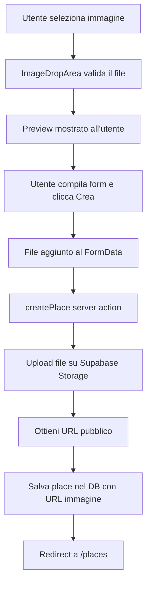
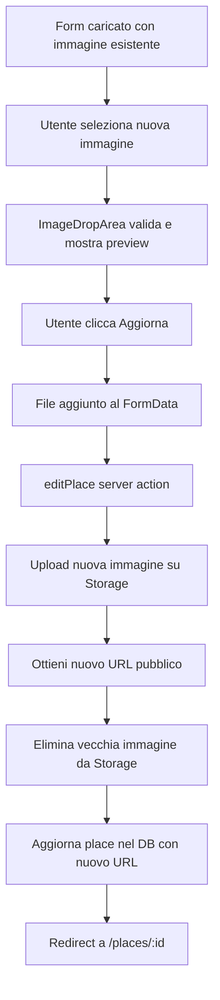

# Sistema di Upload Immagini per Places

Questo documento spiega come funziona il sistema di upload delle immagini per i places nell'applicazione.

## 🏗️ Architettura

### Componenti Principali

1. **ImageDropArea** (`/src/components/ImageDropArea/ImageDropArea.tsx`)
   - Componente UI per drag & drop e selezione file
   - Gestisce preview, validazione e feedback visivo
2. **Storage Functions** (`/src/lib/server/storage.ts`)

   - `uploadImage()`: Carica un'immagine su Supabase Storage
   - `deleteImage()`: Elimina un'immagine da Supabase Storage
   - `replaceImage()`: Sostituisce un'immagine (elimina vecchia + carica nuova)

3. **Place Server Actions** (`/src/lib/server/place.ts`)

   - `createPlace()`: Crea un nuovo place con immagine
   - `editPlace()`: Modifica un place esistente con gestione immagine

4. **ClientPlaceForm** (`/src/app/places/ClientPlaceForm.tsx`)
   - Form client-side che integra ImageDropArea
   - Gestisce lo stato del file e lo invia via FormData

## 🔄 Flusso di Lavoro

### Creazione di un Nuovo Place



### Modifica di un Place Esistente



## 📦 Dettagli Implementazione

### 1. Selezione File (Client)

```tsx
// ImageDropArea.tsx
const handleFile = (file: File) => {
  if (validateFile(file)) {
    // Crea preview per l'utente
    const reader = new FileReader();
    reader.onloadend = () => {
      setPreview(reader.result as string);
    };
    reader.readAsDataURL(file);

    // Notifica il parent component
    onImageSelect(file);
  }
};
```

### 2. Invio Form (Client)

```tsx
// ClientPlaceForm.tsx
async function action(formData: FormData) {
  // Aggiungi file al FormData
  if (selectedImage) {
    formData.set("image", selectedImage);
  }

  // Invia al server
  await createPlace(formData);
}
```

### 3. Upload su Supabase (Server)

```typescript
// storage.ts
export async function uploadImage(file: File, bucket: string, folder?: string) {
  const supabase = await createClient();

  // Genera nome file unico
  const fileName = `${Date.now()}-${file.name.replace(/[^a-zA-Z0-9.-]/g, "_")}`;
  const filePath = folder ? `${folder}/${fileName}` : fileName;

  // Converti File in Buffer
  const arrayBuffer = await file.arrayBuffer();
  const buffer = Buffer.from(arrayBuffer);

  // Upload
  const { data, error } = await supabase.storage
    .from(bucket)
    .upload(filePath, buffer, {
      contentType: file.type,
      upsert: false,
    });

  if (error) return { url: null, error: error.message };

  // Ottieni URL pubblico
  const {
    data: { publicUrl },
  } = supabase.storage.from(bucket).getPublicUrl(data.path);

  return { url: publicUrl, error: null };
}
```

### 4. Salvataggio nel Database (Server)

```typescript
// place.ts
export async function createPlace(formData: FormData) {
  const imageFile = formData.get("image") as File | null;

  let imageUrl: string | null = null;
  if (imageFile && imageFile instanceof File && imageFile.size > 0) {
    const { url, error } = await uploadImage(
      imageFile,
      "places-images",
      "places"
    );
    if (error) {
      return { form: null, errors: { image: [error] } };
    }
    imageUrl = url;
  }

  // Crea place con URL immagine
  const place = { name, description, address, image: imageUrl };
  await supabase.from("places").insert([place]);
}
```

## 🗂️ Struttura Storage

```
Supabase Storage
└── places-images (bucket pubblico)
    └── places/ (folder)
        ├── 1697123456789-locale1.jpg
        ├── 1697123456790-locale2.png
        └── 1697123456791-locale3.webp
```

### Naming Convention

- Formato: `{timestamp}-{sanitized-filename}.{ext}`
- Esempio: `1697123456789-bar_centrale.jpg`
- Il timestamp previene conflitti di nomi

## 🔒 Sicurezza

### Row Level Security (RLS)

Le policy Supabase controllano chi può:

- **Upload**: Solo utenti autenticati (potenzialmente solo Place Managers)
- **View**: Tutti (pubblico)
- **Update/Delete**: Solo utenti autenticati

### Validazione

- **Client-side** (ImageDropArea):
  - Tipo file: solo immagini (`image/*`)
  - Dimensione: massimo 5MB (configurabile)
- **Server-side** (storage.ts):
  - Controllo esistenza file
  - Controllo dimensione
  - Nome file sanitizzato

## 🧪 Testing

### Test Manuale

1. **Nuovo Place**:

   - Vai su `/places/new`
   - Trascina un'immagine nell'area
   - Compila i campi e salva
   - Verifica che l'immagine sia visibile nel place creato

2. **Modifica Place**:

   - Vai su `/places/{id}/edit`
   - Cambia l'immagine
   - Salva
   - Verifica che la vecchia immagine sia stata eliminata da Storage

3. **Validazione**:
   - Prova a caricare un file non-immagine (dovrebbe fallire)
   - Prova a caricare un file > 5MB (dovrebbe fallire)

### Verifica Storage

1. Vai su Supabase Dashboard → Storage → `places-images`
2. Controlla che le immagini siano state caricate
3. Verifica che le vecchie immagini siano state eliminate dopo update

## 🐛 Troubleshooting

### Errore: "Policy violation"

- Controlla che le RLS policy siano configurate (vedi `SUPABASE_STORAGE_SETUP.md`)
- Verifica che l'utente sia autenticato

### Errore: "Bucket not found"

- Crea il bucket `places-images` su Supabase
- Assicurati che sia pubblico

### L'immagine non si carica

- Controlla la console del browser per errori
- Verifica che il file sia effettivamente un'immagine
- Controlla che non superi i 5MB

### La vecchia immagine non viene eliminata

- Controlla la funzione `deleteImage()` in `storage.ts`
- Verifica i log del server per errori
- Controlla le policy DELETE su Supabase

## 📚 File di Riferimento

- [`ImageDropArea.tsx`](/src/components/ImageDropArea/ImageDropArea.tsx) - Componente UI
- [`storage.ts`](/src/lib/server/storage.ts) - Funzioni upload/delete
- [`place.ts`](/src/lib/server/place.ts) - Server actions
- [`ClientPlaceForm.tsx`](/src/app/places/ClientPlaceForm.tsx) - Form integrato
- [`SUPABASE_STORAGE_SETUP.md`](/SUPABASE_STORAGE_SETUP.md) - Setup Supabase

## 🚀 Prossimi Miglioramenti

- [ ] Compressione immagini client-side prima dell'upload
- [ ] Generazione automatica di thumbnails
- [ ] Support per immagini multiple
- [ ] Cropping/editing immagini
- [ ] Progress bar durante l'upload
- [ ] Lazy loading delle immagini
